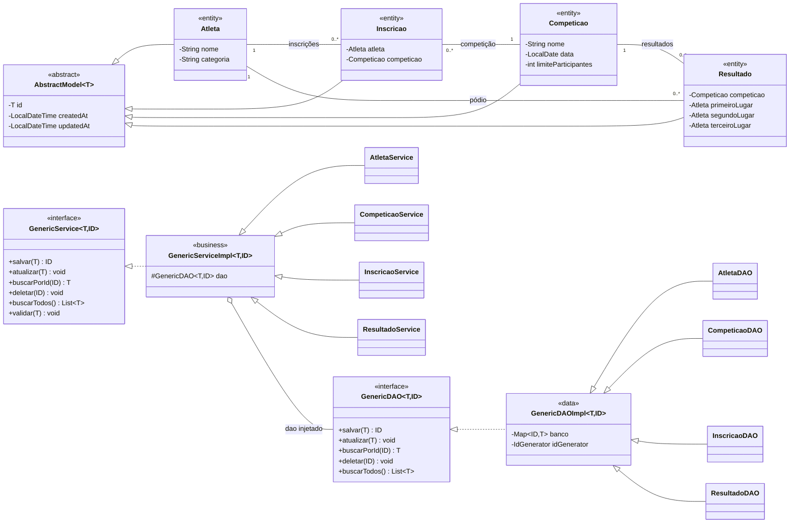
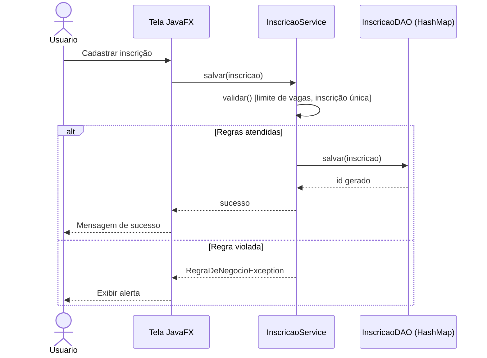

# Sistema Esportivo

Sistema desktop em Java 17 com JavaFX para gerenciar competições, inscrições de atletas e resultados. Usa arquitetura em três camadas com persistência em memória.

## Funcionalidades

- Cadastro e edição de competições com limite de participantes
- Inscrição de atletas em competições, com edição e cancelamento
- Publicação de resultados (pódio)
- Validações de regras de negócio (limite de vagas, inscrição única)
- Excluir um atleta ou uma competição remove junto as inscrições e resultados que dependiam deles
- Arquitetura genérica com `GenericDAO` e `GenericService`
- Geração automática de IDs

## Como executar

1. Compilar e executar os testes:

```bash
mvn test
```

2. Executar a aplicação desktop:

```bash
mvn javafx:run
```

## Estrutura das camadas

- `presentation`: camada de apresentação JavaFX.
- `business`: regras de negócio e validações (`GenericService`/`GenericServiceImpl` e especializações). `FabricaDeServicos` monta os serviços com seus DAOs, então a apresentação recebe apenas interfaces.
- `data`: persistência em memória (`GenericDAO`/`GenericDAOImpl` e especializações).
- `model`: entidades do domínio, todas estendendo `AbstractModel<Long>`.
- `util`: utilitários genéricos (`IdGenerator`).

## Diagrama de classes

> As quatro entidades formam um ciclo (Atleta → Inscrição → Competição → Resultado → Atleta); por isso as classes abaixo são declaradas nessa mesma ordem, o que evita cruzamento de linhas no layout automático do Mermaid.



## Diagrama de sequência: cadastrar inscrição



## Verificação sugerida

- Abrir a aplicação e cadastrar uma competição com limite de participantes.
- Cadastrar atletas e realizar inscrições.
- Tentar duplicar inscrição do mesmo atleta na mesma competição.
- Completar o limite da competição e tentar uma nova inscrição.
- Abrir a tela principal e conferir inscrições e resultados publicados.
- Editar um resultado já cadastrado e salvar novamente.
- Excluir uma competição e conferir que suas inscrições e seu resultado somem junto.