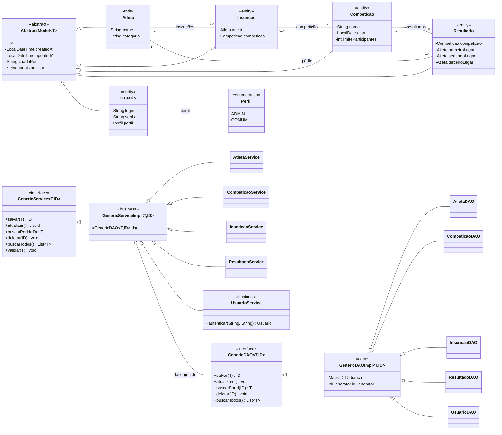
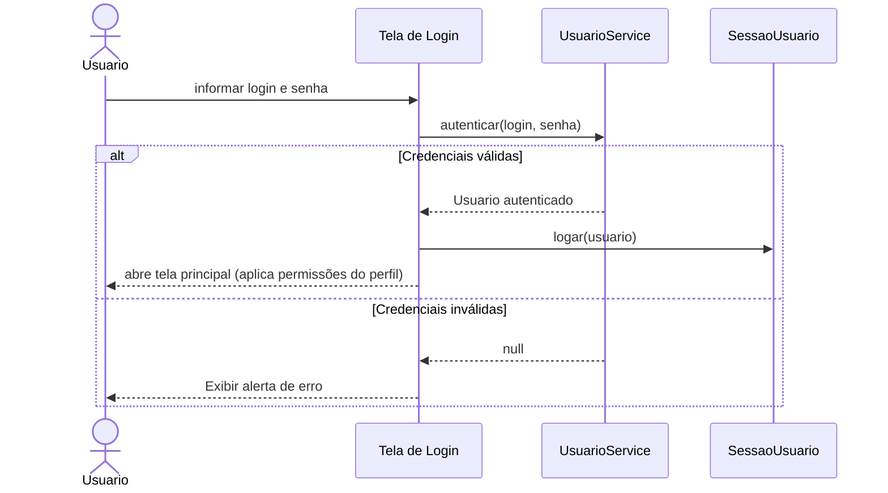
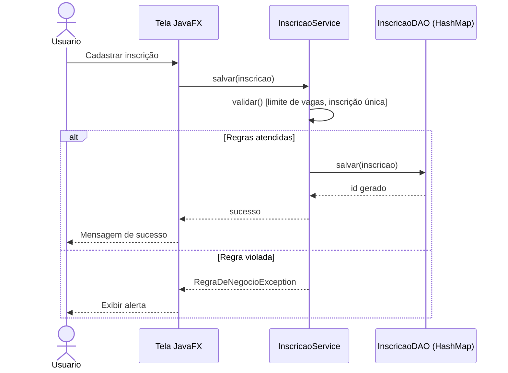

# Sistema Esportivo

Sistema desktop em Java 17 com JavaFX para gerenciar competições, inscrições de atletas e resultados, com login, controle de acesso por perfil e auditoria de registros. Usa arquitetura em três camadas com persistência em memória.

## Funcionalidades

- Login obrigatório para usar o sistema, com dois perfis de acesso: `ADMIN` e `COMUM`
- Cadastro, edição e exclusão de usuários (somente `ADMIN`)
- Tela de auditoria somente leitura, com quem criou/alterou cada registro e quando (somente `ADMIN`)
- Cadastro e edição de competições com limite de participantes
- Inscrição de atletas em competições, com edição e cancelamento
- Publicação de resultados (pódio)
- Validações de regras de negócio (limite de vagas, inscrição única, login único, um resultado por competição, colocados distintos)
- Excluir um atleta ou uma competição remove junto as inscrições e resultados que dependiam deles
- Excluir um usuário não é permitido enquanto ele estiver logado
- Arquitetura genérica com `GenericDAO` e `GenericService`
- Geração automática de IDs

## Como executar

1. Compilar e executar os testes:

```bash
mvn test
```

2. Executar a aplicação desktop:

```bash
mvn javafx:run
```

## Credenciais iniciais

Como a persistência é em memória, o sistema não tem usuários pré-cadastrados em disco. Por isso, **a cada execução** (não só na primeira) ele cria automaticamente um usuário administrador padrão, caso ainda não exista nenhum usuário:

| Login   | Senha   | Perfil  |
|---------|---------|---------|
| `admin` | `admin` | `ADMIN` |

Use essas credenciais para o primeiro acesso. A partir daí, um `ADMIN` pode cadastrar os demais usuários (`ADMIN` ou `COMUM`) pela aba Usuários.

## Passo a passo de uso

1. **Login**: a aplicação sempre abre na tela de login. Entre com as [credenciais iniciais](#credenciais-iniciais) (`admin` / `admin`) ou com um usuário `COMUM` já cadastrado.
2. **Tela principal**: após o login, abre a tela com abas para Atletas, Competições, Inscrições, Resultados e, apenas para `ADMIN`, Usuários. O botão de Auditoria também só aparece para `ADMIN`.
3. **Cadastrar um atleta**: aba Atletas → botão de cadastro → informar nome e categoria → salvar.
4. **Cadastrar uma competição**: aba Competições → botão de cadastro → informar nome, data e limite de participantes → salvar.
5. **Inscrever um atleta**: aba Inscrições → botão de cadastro → escolher atleta e competição → salvar. O sistema bloqueia a inscrição se a competição estiver cheia ou se o atleta já estiver inscrito nela.
6. **Editar ou excluir**: em qualquer tabela, use os botões de ação na última coluna de cada linha. Excluir sempre pede confirmação; excluir atleta ou competição também remove em cascata as inscrições e resultados associados.
7. **Publicar um resultado**: aba Resultados → botão de cadastro → escolher a competição e os três primeiros colocados (a partir dos atletas inscritos nela) → salvar. Cada competição só pode ter um resultado, e os três colocados precisam ser atletas diferentes.
8. **Gerenciar usuários** (somente `ADMIN`): aba Usuários → cadastrar, editar ou excluir usuários, definindo login, senha e perfil (`ADMIN` ou `COMUM`). Não é possível excluir o próprio usuário logado.
9. **Consultar auditoria** (somente `ADMIN`): botão Auditoria na tela principal → lista somente leitura com todos os registros do sistema (atletas, competições, inscrições, resultados e usuários), mostrando quem criou e quem fez a última alteração em cada um, com data e hora.
10. **Sair**: botão de sair na tela principal encerra a sessão e volta para a tela de login.

## Estrutura das camadas

- `presentation`: camada de apresentação JavaFX (telas de login, cadastro/edição de cada entidade e auditoria). `Theme` aplica o estilo visual às cenas.
- `business`: regras de negócio e validações (`GenericService`/`GenericServiceImpl` e especializações, incluindo `UsuarioService` para autenticação e unicidade de login). `FabricaDeServicos` monta os serviços com seus DAOs como instância única, então a apresentação recebe apenas interfaces e todas as telas enxergam os mesmos dados.
- `data`: persistência em memória (`GenericDAO`/`GenericDAOImpl` e especializações, incluindo `UsuarioDAO`).
- `model`: entidades do domínio, todas estendendo `AbstractModel<Long>` (que carrega também `criadoPor`/`atualizadoPor` para a auditoria). Inclui `Usuario` e o enum `Perfil`.
- `util`: utilitários genéricos (`IdGenerator`, `SessaoUsuario` para guardar o usuário logado na sessão).

## Diagrama de classes



## Diagrama de sequência: login



## Diagrama de sequência: cadastrar inscrição



## Verificação sugerida

- Fazer login com `admin` / `admin` e conferir que as abas de Usuários e o botão de Auditoria aparecem.
- Cadastrar um usuário `COMUM`, sair e entrar com ele, conferindo que a aba de Usuários e o botão de Auditoria somem.
- Tentar cadastrar um usuário com login já existente e conferir a mensagem de erro.
- Logado como `admin`, tentar excluir o próprio usuário e conferir que é bloqueado.
- Abrir a auditoria e conferir que os registros mostram quem criou/alterou cada um e quando.
- Abrir a aplicação e cadastrar uma competição com limite de participantes.
- Cadastrar atletas e realizar inscrições.
- Tentar duplicar inscrição do mesmo atleta na mesma competição.
- Completar o limite da competição e tentar uma nova inscrição.
- Abrir a tela principal e conferir inscrições e resultados publicados.
- Editar um resultado já cadastrado e salvar novamente.
- Tentar publicar um segundo resultado para a mesma competição e conferir o bloqueio.
- Tentar publicar um resultado repetindo o mesmo atleta em duas posições e conferir o bloqueio.
- Excluir uma competição e conferir que suas inscrições e seu resultado somem junto.